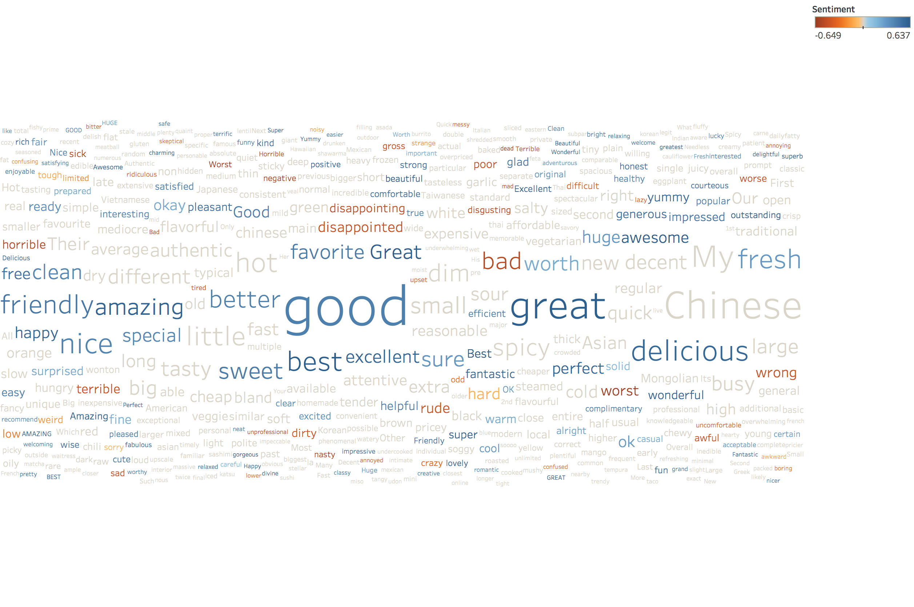
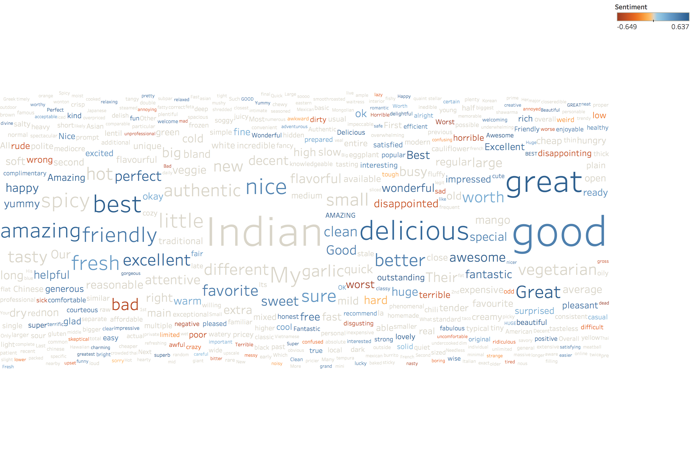
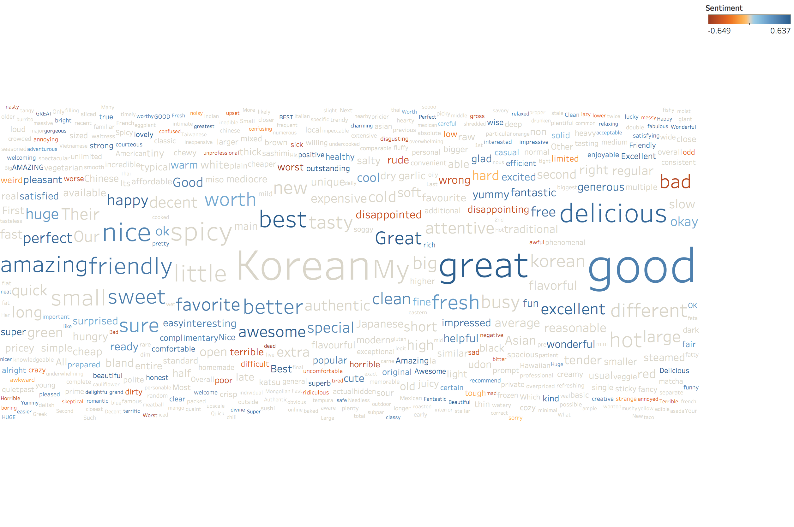
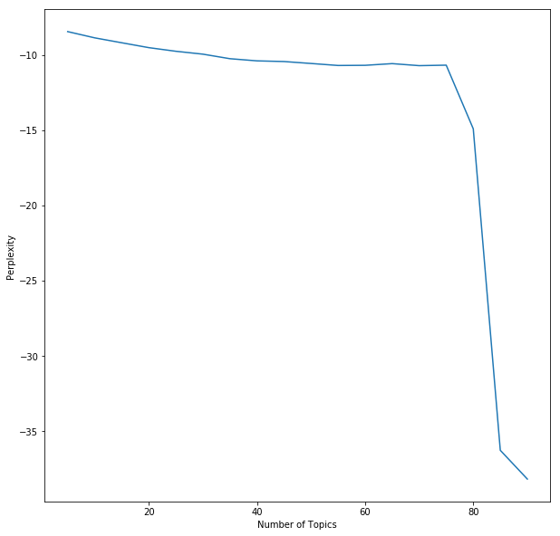

# Chicago Operating Report, 2017
This repo is my work on the capstone project for IBM's Data Science DevUp program. Project requirements are listed in [this file](DevUp%20Capstone%20Information%20-%20For%20Learners/CBDS%20DevUp%20-%20Data%20Scientist%20-%20Capstone.docx).

Divvy data downloaded from here: https://www.divvybikes.com/system-data
Yelp data downloaded from here: https://www.yelp.com/dataset/download
Kaggle data (for weather) downloaded from here: https://www.kaggle.com/yingwurenjian/chicago-divvy-bicycle-sharing-data

## Workflow
1.	Download the datasets from Divvy’s website and from Yelp’s. There is a pre-processed Divvy dataset available on Kaggle but I chose to use Divvy’s raw data and process it myself. I used the Kaggle dataset only to extract weather historical weather data (I have previously used Weather Underground, but they have recently removed free access to their API).
2.	Divvy provides a live JSON feed of data from their stations. This is the only source of GPS data available (except for the Kaggle dataset). There are a few stations in the 2017 data which are not included in the JSON feed, so I assume these stations have been removed. They were not popular stations and otherwise did not come up in my analysis, so I removed them from analyses which required GPS information.
3.	Data munging can be followed along in the included Jupyter notebook.
## Visualizations
### Divvy

#### Top 5 stations with the most starts:

- Streeter Dr & Grand Ave, 97,571 starts
- Lake Shore Dr & Monroe St, 53,400 starts
- Canal St & Adams St, 50,911 starts
- Clinton St & Washington Blvd, 49,832 starts
- Theater on the Lake, 47, 908 starts

#### Trip duration by user type

- Trip durations trail off dramatically after 60 minutes. There are several thousand outliers above this limit, some going up to 24 hours. I have excluded these outliers from further analysis.
.png)
- Customer (24-hour pass) median trip duration: 1351 seconds (23 minutes)
- Dependent (Explore pass) median trip duration: 804 seconds (13 minutes)
- Subscriber (annual pass) median trip duration: 572 seconds (10 minutes)

#### Most popular trips based on start and stop stations

- Many of the most popular routes are doubled, ie Point A to Point B as well as Point B to Point A. Two (shown as a large circle) are circular routes (Point A back to Point A), possibly tourists exploring the city.
 
#### Rider Performance by gender and age.
I binned the ages into generational categories for this analysis. Additionally, I excluded ages below 10 and above 80. There are a very small handful of ages in the dataset between 0 and 10 but quite a few at 0 exactly. Also, there were quite a few ages above 100. Both ages at 0 and above 100 seem very suspect but because they were a small portion of the data, excluding them seemed the proper approach.

- Both by median speed and average trip distance, Millennials were the highest achievers followed by Gen Xers and Baby Boomers with Gen Z picking up the rear.
- By median speed, the Silent Generation was the slowest but by average trip distance, the Silent Generation beat Generation Z as well as Baby Boomers. Interestingly, women of the oldest generation had the longest overall trip distance.
- Men rode faster than women on balance, but women rode further than men.

- The majority of riders are between ages 20 and 40, with men accounting for more of the share than women. Even though some ages in the dataset extend all the way up to 120, and many down to 0, I have only included ages between 10 and 80 in this analysis.

#### Busiest bike in Chicago in 2017.
Statistics were calculated in a Tableau file using a CSV output from previous analysis.
- Bike ID: 2565
- Rides: 1,489
- Minutes ridden: 22,526 (375 hours)
- Miles ridden: 2,175
- Average speed: 5.79 mph

- Each of the 6,243 bikes ridden in 2017 is shown by a single vertical line. The height of the line represents the number of rides taken on that bike and the color shows the total miles ridden.
- Bike 2565, the busiest bike, is the line on the far left.
- Possibly some bikes were introduced late in the year and not used as much, but it does appear that a better distribution could be attained by moving bikes around, thus spreading out maintenance evenly.

### Yelp

#### Top 10 and Bottom 10 restaurants in Illinois by check-ins.
I included only restaurants which were marked as open in the dataset and also excluded restaurants with no check-ins, simply because there were many of them and I wanted to be sure we were looking at real restaurants.

- Note that the x-axis starts over and changes scale between the top 10 and bottom 10 restaurants. Restaurants with 0 check-ins have been excluded.

#### For the Top 10 and Bottom 10, calculate average star rating and sentiment.
I used the [VADER](https://github.com/cjhutto/vaderSentiment) package for python to analyze sentiment. VADER stands for Valence Aware Dictionary for sEntiment Reasoning; it is specifically tuned to handle social media posts, so I thought it would be good with the Yelp dataset.

- Sentiment is on a scale of 0 between extremely negative to 5 between extremely positive.

#### Top 10 cuisine types based on number of restaurants and number of check-ins.
For this section, I looked at every entry in the Category column of the Yelp dataset. I included only business which had “Restaurant” as the category. Then I sorted all of the categories by frequency and by hand selected those categories which were ethnic cuisines. For example, “Pizza” and “Sandwiches” category came up, but I didn’t classify them as Cuisine per se and so did not include them here.

- The top 10 cuisine types by number of restaurants and by number of check-ins is the same, but the order is slightly different.

#### What are the most popular keywords or adjectives reviewers use for each cuisine?
Almost every cuisine’s most popular descriptor is “Good.” “Great” and “Delicious” also come up a lot. Indian and Korean are exceptions: their most popular adjectives are the “Indian” and “Korean” respectively.
- All cuisines:

- Asian Fusion:

- Chinese:

- French:

- Indian:

- Italian:

- Japanese:

- Korean:

- Mediterranean:

- Mexican:

- Thai:

#### Are there any temporal trends?

- Check-ins are highest on the weekends and drop during the week (with a small pick-up on Wednesday).

- Check-ins are lowest in the winter and highest in the summer.

- Most holidays feature fewer check-ins, except for New Year’s Eve, Election Day, and President’s Day. There is a spike on August 12th, International Youth Day, but I doubt that holiday is the reason for the spike, which remains unexplained. I searched and could not find any historical events which occurred on that day. Similarly, for June 8th, where there is a drop which does not coincide with any major event or holiday I could find. I found it interesting that check-ins on Valentine’s Day are low, however check-ins do rise above the norm for the weekends immediately before and after.

## Additional questions
### Trip duration prediction model

The easiest (and possibly the most accurate) method to build a trip duration prediction model would be to simply plug in to [Google’s Maps API](https://developers.google.com/maps/documentation/distance-matrix/intro) which will provide a road-by-road route as well as an estimated duration, based partly on the time of day and current conditions. Google used to offer this for free (rate-limited, of course) but has recently started charging even for academic use. Therefore, I built my own model.

I used direct line Trip Duration as an input, because the more accurate method of following roads is quite a bit more advanced than the scope of this project. I also wanted to include weather information and went to [Weather Underground](https://www.wunderground.com/weather/api), my go-to API for weather data. However, they, too, have recently gone under a paywall so I downloaded the [Divvy dataset from Kaggle](https://www.kaggle.com/yingwurenjian/chicago-divvy-bicycle-sharing-data), which does include weather data, and joined the weather data into my processed data. I also looked at government statistics regarding [traffic flows](https://www.illinoisvehicle.com/about-us/blog/traffic-patterns-chicago/) in Chicago and added Rush Hour as a feature in my data. I dummified data for day-of-week, month, user type, weather events, and weather conditions.

I used [Scikit Learn’s linear regression](http://scikit-learn.org/stable/modules/generated/sklearn.linear_model.LinearRegression.html) model as well as its [train-test-split](http://scikit-learn.org/stable/modules/generated/sklearn.model_selection.train_test_split.html) function, so I could measure accuracy without any bias. My final accuracy was 69.5%, not very good but not bad at all for an initial pass. And after plotting the data it is clear that a high-accuracy model would not be possible; there’s just too much noise in the data. Some people ride quickly from Point A to Point B, while others take their time (up to several hours!). In this model, I excluded trips over an hour and less than 200 meters, which helped a good deal (not least by removing those trips from Point A to Point A which really threw off the predictions!)

- This shows predicted vs actual travel times for a given trip. In a perfect model, all points would lie along the orange line.

### Correlation between review length and star rating.
I find no correlation between review length and start rating. The regression model shows a slight negatively-sloping line comparing the two variables, but the P-value is 0.0 which means we must reject the null hypothesis that the data is correlated. In short, the model would predict a review length of ~700 characters regardless of how many stars were awarded.

- Review length as a function of star rating

### Topic modeling
I performed LDA analysis on the text of the reviews. Processing time became a serious constraint in this part of the project. To help, I took a random sample of 50,000 reviews instead of the more than 600,000 available in total. I removed stop words and lemmatized in order to reduce the sparsity of my matrix and only include meaningful words. Additionally, I removed all punctuation. I did not build bigrams and trigrams, in order to reduce processing time, but feel this is a good area for improvement. Finally, I built LDA models using a number of topics of 5, 10, 15, 20, 30, 40, 50, and 75, and stored the perplexity at each value. Using this, I could plot the perplexity vs number of features and look for an elbow. Unfortunately, I don’t feel I captured the elbow. I need a finer-grained selection of topics numbers and also need to expand the set, possibly up to 300.

What I have now is a list of words (which can be seen in the Jupyter Notebook) belonging to each of 50 topics (I chose 50 nearly arbitrarily, although the elbow plot does show a slight bend at this point). The next step would be to have an SME go through these words and manually name each cluster, depending upon the vocabulary. Probable clusters might include café, pizza, quiet, date, etc.

